# MangaWatcher

## Описание
Приложение предназначено для отслеживания выхода новых глав манги, которую добавил пользователь

## Как пользоваться
Первое что видит пользователь, при открытии приложения - это стартовая страница.
Стартовая страница представлена ниже.
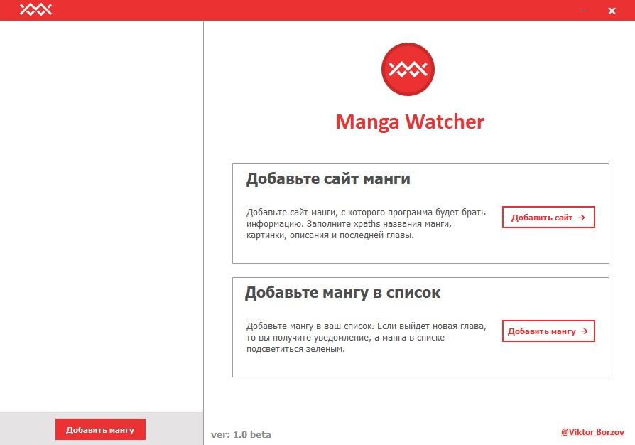

Для начала необходимо добавить сайт, с которого приложение будет считывать информацию.
После нажатия "Добавить сайт", откроется список сайтов. Если вы впервый раз запустили приложение, то он будет пустым.
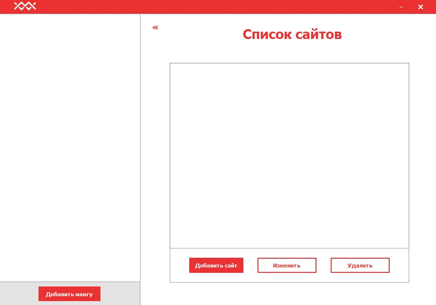

Нажав "Добавить сайт", откроется форма для ввода xpath к необходимой информации на сайте.
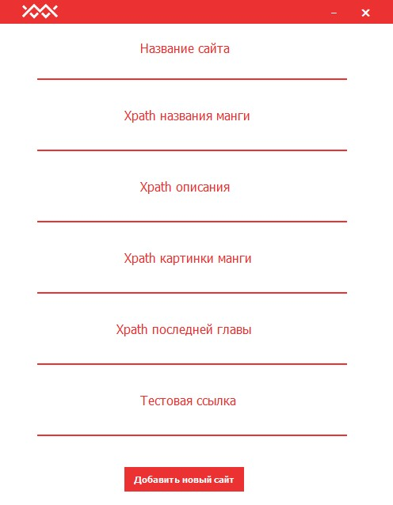

Если вы не знаете, что такое XPath, то не беспокойтесь. Далее я объясню откуда их взять.
Для начала откройте сайт с мангой (Для примера я буду использовать сайт MangaLib)

Выбрав сайт для добавления, введите его название (Название может быть любым)

Далее необходимо ввести XPath названия манги. Для этого нажмите ПКМ по названию манги в браузере и выберите "Посмотреть код элемента". После этого откроется окно с кодом сайта.
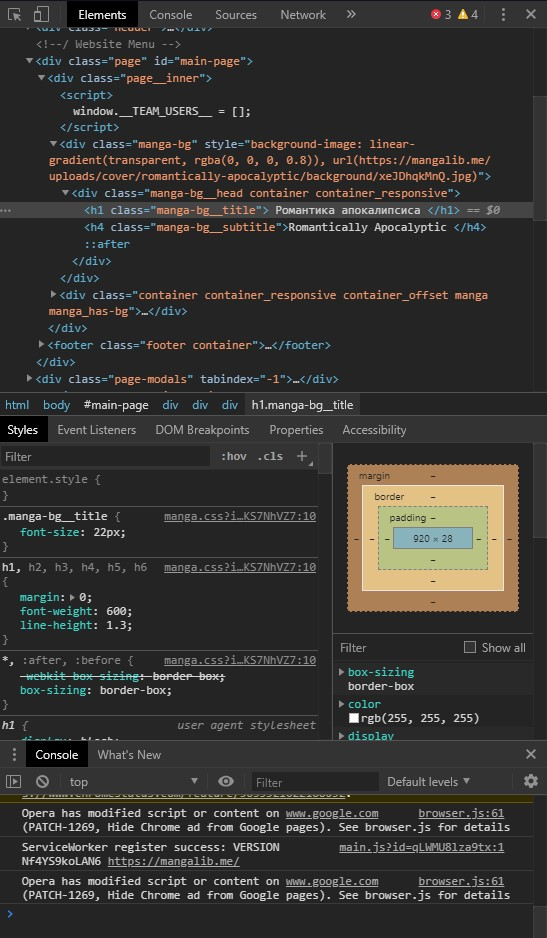

Наведя мышку на выделенный фрагмент кода, нажмите ПКМ, далее "Скопировать" -> "Скопировать XPath"
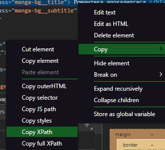

Далее необходимо вставить XPath в форму для добавления сайта
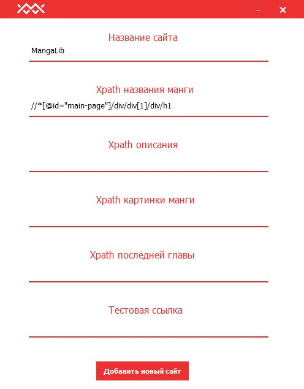

Похожим образом получается XPath описания манги, картинки и последней главы
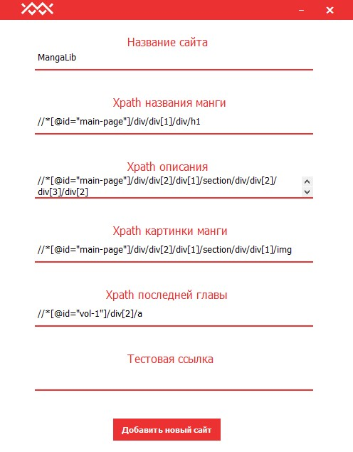

После заполнения всех XPath, вам необходимо ввести тестовую ссылку.
**Что такое тестовая ссылка?** 
Тестовая ссылка - это страница сайта, по которой будут оптимизироваться XPath.
**Для чего это надо?**
Некоторые сайты использую несколько шаблонов страниц для отображения манги. Это создает ситуации, когда с одного и того же сайта одна манга может считаться нормально, а другая - нет.

Вставьте в поле "Тестовая ссылка" ссылку на страницу, с которой копировали все XPath.
В результате так должна выглядеть форма для добавления сайта:
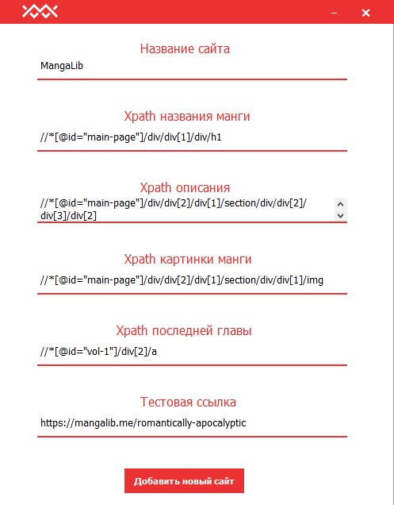

После нажатия "Добавить сайт", сайт появится в списке сайтов
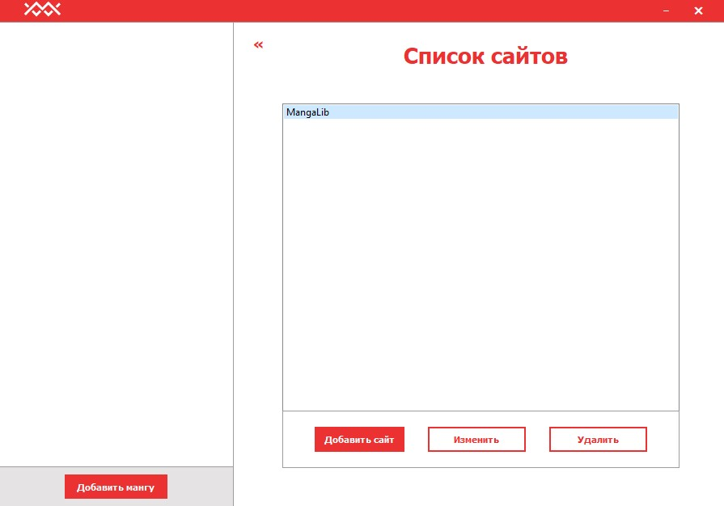

Далее нажмите на кнопку "Добавить мангу" под пустым списком манги, выберите сайт, и введите ссылку.
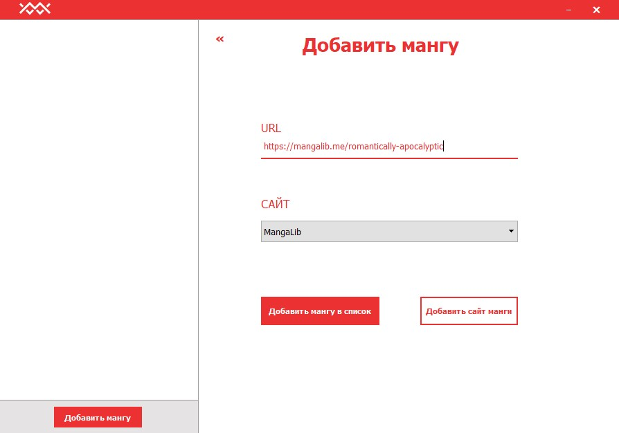

Если все ссылки введены правильно, то в списке появится манга.
Когда выйдет новая глава, в правом нижнем углу высветиться уведомление, а манга в списке будет выделена зеленым цветом.
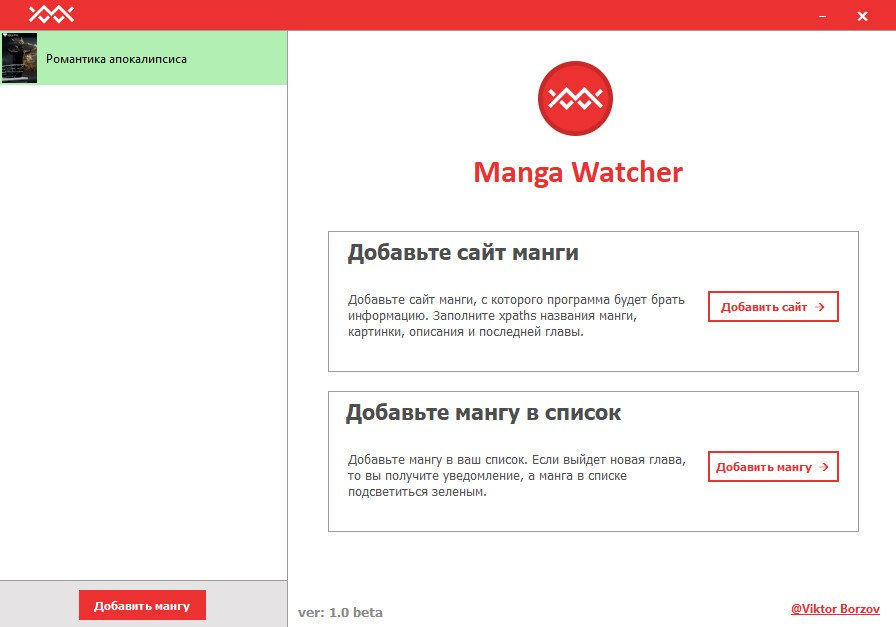

При нажатии на мангу в списке, выведется информация о этой манге: название, описание и номер новой главы.
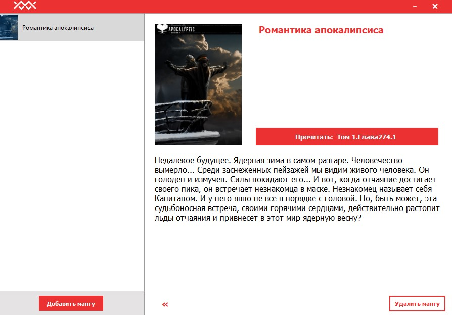

Приложение может работать в фоновом режиме. Для этого нужно его просто закрыть, тогда выведется уведомление о переходе приложения в фоновый режим.

## Пожелания
Удачного использования!
Я буду обновлять приложение по мере возможностей.